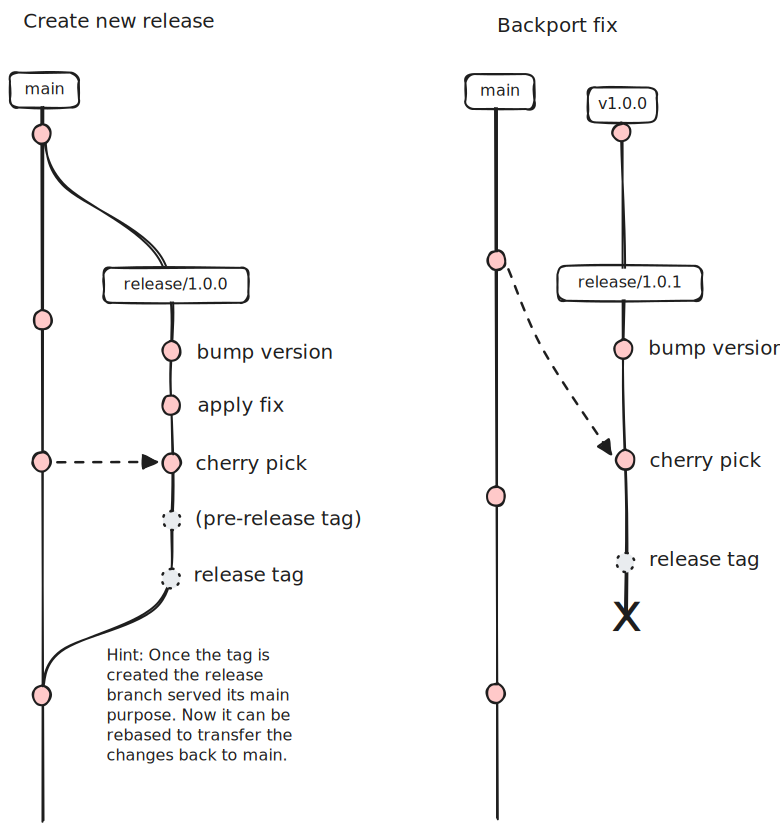

# Release process

We try to maintain a simple release process based on git tags using release branches where necessary.

We automatically build dev releases for every push to `main` or `release/*` branches. You can also trigger the release workflow by hand to build a dev release from another branch. Dev releases publish `dev-*` tags to docker and upload other release artifacts to our file server, since we do not want to create a GitHub release for dev releases. They are mainly used by us to test non-released versions on our test systems.

## Prepare a release

If you want to perform a feature freeze create a release branch (e.g. `release/1.0.0`). Bump the version on the branch, apply fixes and cherry pick additional commits if needed. Once the release is done create a PR to merge changes back to `main` (the branch is not immutable, you can absolutely edit it after the release). If a feature freeze is not needed, bumping the version and releasing can also be done on the `main` branch.

## Patch versions / Backporting

If you want to release a patch release for a non-recent version create a release branch from the published tag. Cherry-pick fixes you want to backport. After the version is released delete the branch.

## Publish a release

To publish a release create a tag matching the schema `vX.Y.Z`. This will trigger the release workflow, which will build and push the docker images aswell as our binary artifacts. It will then create a draft for the GitHub release. Give it the final touch and press publish in GitHub. Be aware that the docker tags are already pushed, so you should not wait too long with publishing the GitHub release to avoid confusion.

## Publish a pre-release

To publish a pre-release append a hyphen and a pre-release name to the tag (e.g. `v1.0.0-beta.1`).
